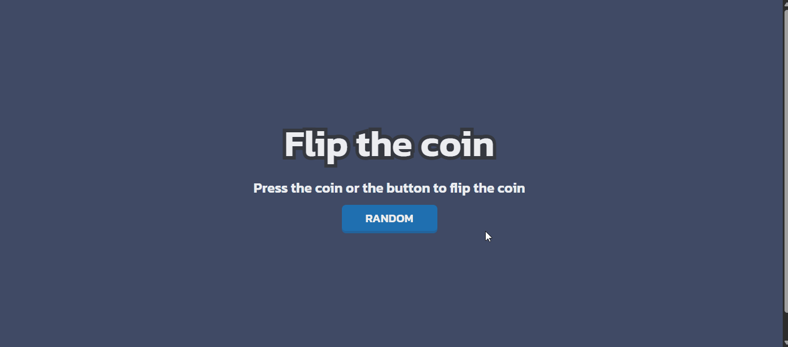

<h1 align="center">Flip The Coin | devChallenges</h1>

   Solução para o desafio <a href="https://devchallenges.io/challenge/flip-the-coin" target="_blank">Flip The Coin</a> do <i>site</i> <a href="http://devchallenges.io" target="_blank">devChallenges.io</a>.

  <h3>
    <a href="https://hugo-moreira91.github.io/flip-coin/">
      Solução
    </a>
     | 
    <a href="https://devchallenges.io/challenge/flip-the-coin">
      Desafio
    </a>
  </h3>

## Tabela de Conteúdos

- [Visão geral](#visão-geral)
  - [O que aprendi](#o-que-aprendi)
  - [Recursos úteis](#recursos-úteis)
- [Construído com](#construído-com)
- [Características](#características)
- [Autor](#autor)

## Visão geral

Acima temos uma breve demonstração do projeto em funcionamento. 

Seu funcionamento gira em torno do botão "RANDOM": ao pressioná-lo, gera-se randomicamente os lados de uma moeda, *Heads* (Cara) e *Tails* (Coroa).

### O que aprendi

Além da estruturação do projeto via HTML, estilização e responsividade através do CSS, o foco maior foi em planejar e construir o funcionamento do projeto via JavaScript.

Após selecionar o elemento *button* do DOM via método *getElementById* adicionei a ele um "ouvinte" através do evento *addEventListener*, detectando os cliques sobre o botão.

A cada clique, o método *random()* da biblioteca *Math* gera um valor entre 0 (zero) e 1 (um). Definiu-se que, para valores menores que 0.5 teríamos o lado Cara (Heads). Logo, para valores entre 0.5 e 1, o lado Coroa (Tails).

Adicionei ao projeto um contador para sequências de Caras e Coroas.

Para exibir os elementos HTML na tela, utilizei a propriedade *innerHTML*.

### Recursos úteis

- [Evento *addEventListener*](https://developer.mozilla.org/pt-BR/docs/Web/API/EventTarget/addEventListener): artigo da MDN Web Docs que traz a explicação, sintaxe e exemplos de uso do evento em questão;

- [Método Math.random()](https://developer.mozilla.org/en-US/docs/Web/JavaScript/Reference/Global_Objects/Math/random): artigo da MDN explicando o uso do método *random* da biblioteca *Math*;

- [Element.innerHTML](https://developer.mozilla.org/pt-BR/docs/Web/API/Element/innerHTML): artigo da MDN o qual traz bons exemplos de uso da propriedade *innerHTML*, além da diferença do *textContent*.

### Construído com

- Marcações semânticas HTML
- Propriedades personalizadas CSS
- Flexbox
- JavaScript
- Responsividade

## Características

Este projeto foi desenvolvido para submissão de um desafio do *site* [DevChallenges](https://devchallenges.io/challenges-dashboard).

## Autor

  

  <a href="https://github.com/Hugo-Moreira91">Hugo Moreira 🚀</a>

  Feito com ❤️

Entre em contato! ✍🏽

